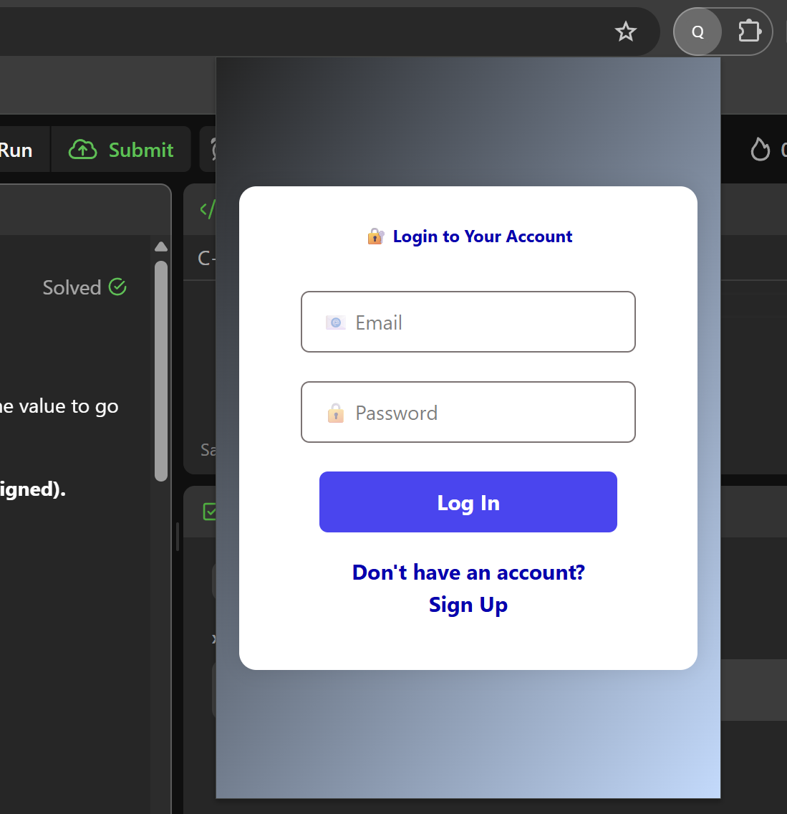
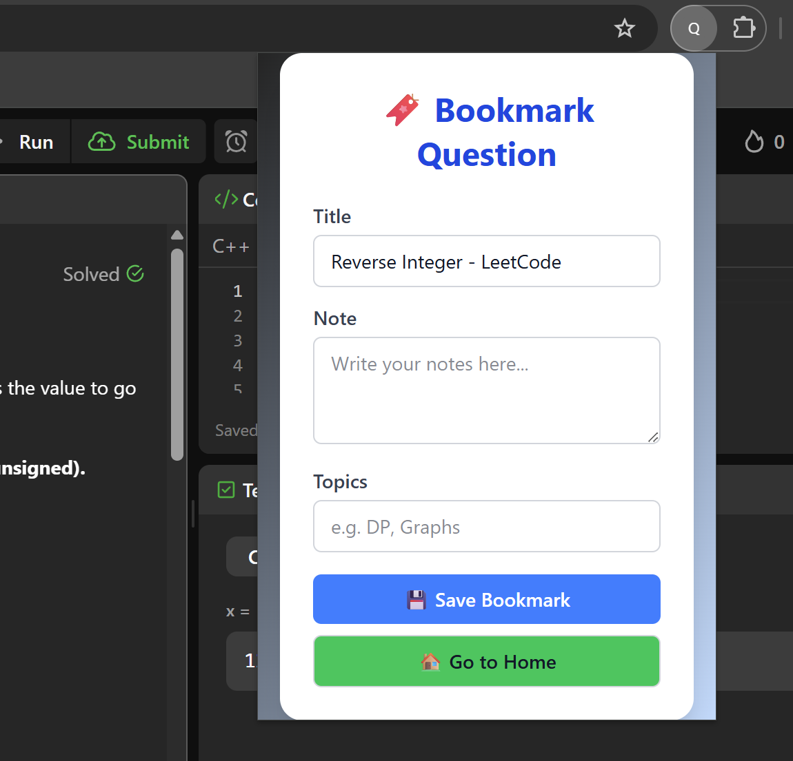
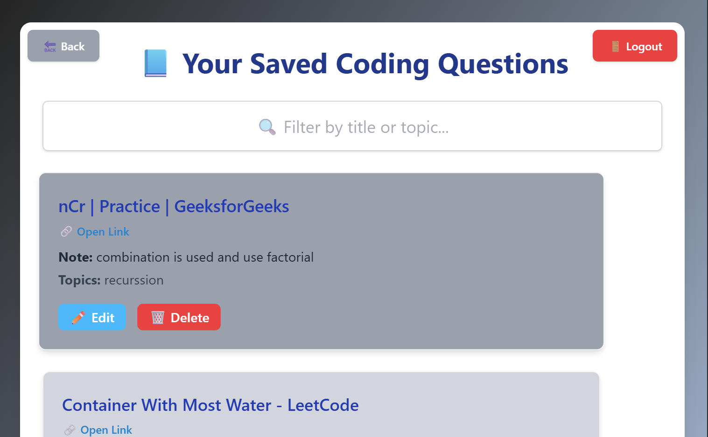

# 🧠 CodeBooker - Smart Bookmarking for Coders

**CodeBooker** is a powerful Chrome extension built for coding enthusiasts. It lets you bookmark coding questions across platforms like **LeetCode**, **GFG**, and **Codeforces**, take personal notes, link similar questions across sites, and organize them for future reference.

---

## 🔗 Features

- 📌 Bookmark questions from LeetCode, GFG, and Codeforces in one click
- 📝 Add personal notes or explanations
- 🔄 Attach related links (same question on other platforms)
- 🏷️ Tag questions with topics like DP, Graphs, etc.
- 🔍 Search and filter your saved bookmarks
- 🧠 Built with a clean and user-friendly popup interface
- 💾 Persistent storage using Chrome local storage

---

## 🚀 Demo

> 📸 *Screenshots ...*
### 🏠 Home Page


### 💼 Projects Section


### ✉️ Contact Section

---

## 🛠️ Tech Stack

- **Frontend**: HTML, CSS, JavaScript
- **Storage**: Chrome Local Storage API
- **Build Tools**: Vite (optional, if you used it)
- **Extension APIs**: Chrome Extension Manifest v3

---

## 🧪 How to Use / Install Locally

1. Clone the repo:
   ```bash
   git clone https://github.com/ujjwal-kumar01/Coding_Extension.git
2. Navigate to the coding_extension directory
3. npm run build
4. Go to chrome://extensions/
5. Enable Developer Mode
6. Click 'Load unpacked'
7. Select the dist folder that was created in step 3
8. You should now see the extension in the extensions list
9. Click the extension to open it

## 🧪 Run Backend
1. Install the required packages by running `npm install` in the root directory.
2. Run the backend server using `npm run start` in the root directory.
3. The extension will now be able to communicate with the backend server.
---